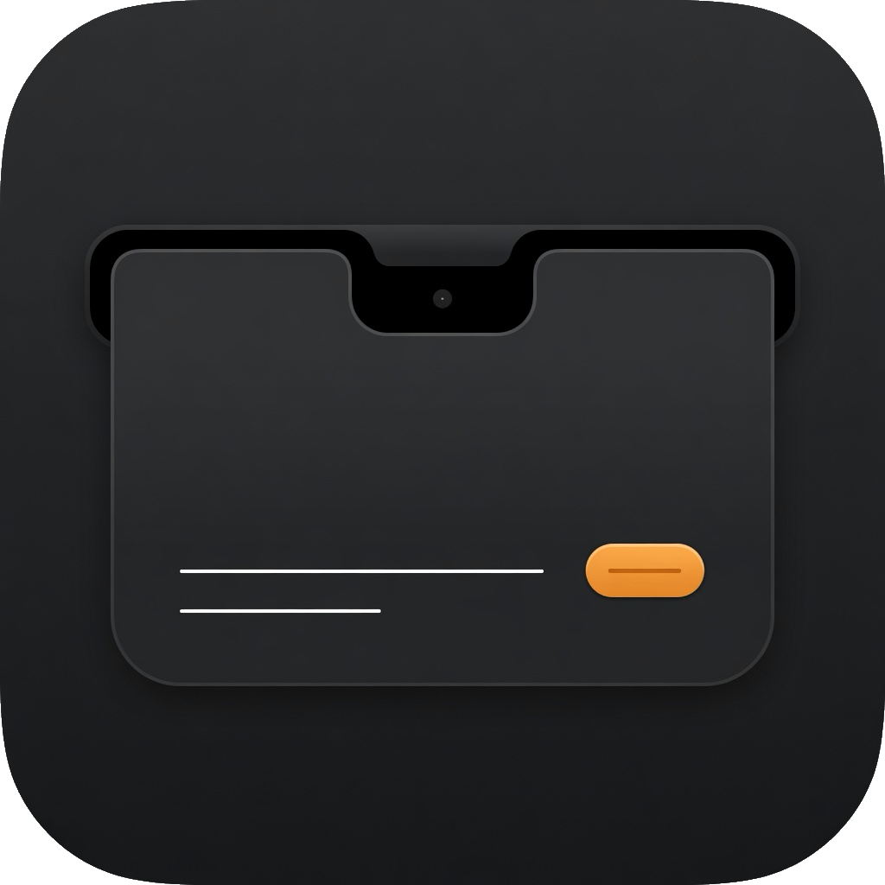

# AskDroid



Press a hotkey on your Mac. A HUD grows out of the camera housing. Ask Pi or Droid, paste images, watch the answer stream, keep a Markdown file.

> **Independent Open-Source Client.** AskDroid is an independent desktop assistant for your local `pi` or `droid` CLI. It is not created by or affiliated with [Pi](https://pi.dev) or [Factory](https://factory.ai).

On a notched MacBook the surface uses the real notch size and a Dynamic Island silhouette. External displays and older Macs get a floating capsule instead.


**Watch it in action:**


```
⌃⌘D  →  type or paste  →  ⌘Return  →  ~/Library/Application Support/AskDroid/answers/
```

AskDroid is a native Swift/SwiftUI agent app. It speaks JSON-over-stdio directly to the CLI you already have installed on your Mac:
- **Pi** (`pi --mode rpc --no-session`) — *Default*
- **Droid** (`droid exec --input-format stream-jsonrpc --output-format stream-jsonrpc`)

## What you need

- macOS 14 or later
- [Pi CLI](https://pi.dev/docs/latest) (default) or [Droid CLI](https://docs.factory.ai/droid-exec/overview)
- Xcode / Swift 6 to build from source

## Install

**From a release (recommended):** download the latest `AskDroid-<version>-macOS.zip` from the Releases page, unzip, and move `AskDroid.app` to `/Applications`.

The builds are ad-hoc signed (no Developer ID), so Gatekeeper may block the first launch of a downloaded copy. Right-click **AskDroid** in Finder → **Open**, or run `xattr -dr com.apple.quarantine "/Applications/AskDroid.app"`. Notarized builds are planned.

**From source:** see [Build](#build) below.

The app is an accessory process: no Dock icon, no menu bar item. The hotkey is the front door — after launching, press **⌃⌘D** and the HUD appears.

To start it at login, open the HUD, click the gear, enable **Launch at login**.

### Local Network permission

AskDroid talks to your agent CLI, which may in turn reach a model server on your local network (for example, Ollama or a local MLX server). The first time that happens, macOS asks for **Local Network** permission:

1. Launch AskDroid and ask a question.
2. If macOS prompts *"AskDroid would like to find and connect to devices on your local network"*, click **Allow**.

If the HUD is open when the prompt appears, it can hide behind the panel and the run fails with a *Connection error* and no answer. Fix it in **System Settings → Privacy & Security → Local Network → enable AskDroid**, quit and relaunch AskDroid, then ask again. AskDroid's failure message points here automatically.


## Build

```bash
git clone <this-repo> AskDroid
cd AskDroid
./scripts/build-app.sh
open dist/AskDroid.app
```

## Use it

1. Press **⌃⌘D** from any app.
2. Type a question. Paste or drop images. **⌘Return** asks, **Esc** hides.
3. While the agent works, the HUD streams the answer. Hide it and a compact pill stays beside the notch. Click the pill or press the hotkey to open it again.
4. Copy the answer (**⌘C** copies the whole answer when it's ready), or open the archived Markdown file.

The HUD sets `NSWindow.sharingType = .none` and hides the compact pill during system screenshots (⌘⇧3 / 4 / 5) and Screenshot.app. A hotkey present still shows the panel. ScreenCaptureKit recorders on macOS 15+ can still see it.

On login-item launch the HUD stays hidden until you press the hotkey. Opening the app from Finder or Spotlight still presents the composer.

The hotkey is configurable in Settings: click the field and press a shortcut (must include ⌘, ⌃, or ⌥). If another app already owns that Carbon hotkey, AskDroid says so.

The answer streams token by token, with elapsed time and token counts. Session activity is behind a disclosure:


When the turn finishes you get the whole answer, a copy button, and a link to the saved file:


Press **Esc** mid-run and the HUD collapses to a pill that keeps the status under the notch:


Files land in **Application Support/AskDroid/answers**:

```
pi-2026-08-20_22-30-00.md
pi-2026-08-20_22-30-00-1.png
```

If two questions finish in the same second, the next file gets a `-2` suffix.

## Settings


All optional. Blank means “use the engine’s defaults.”

- **Engine:** Switch between **Pi** (default) and **Droid**
- **Model override:** Model name or provider pattern
- **Reasoning effort:** `Default`, `Off`, `Minimal`, `Low`, `Medium`, `High`, `X-High`, `Max`
- **Autonomy:** Droid only (`Read-only`, `Low`, `Medium`, `High`)
- **Working directory:** (default `~/Library/Application Support/AskDroid/workspace`)
- **Answers folder:** (default `~/Library/Application Support/AskDroid/answers`)
- **Engine binary:** Custom path override or auto-discovery (searches `PATH`, `~/.local/bin`, mise shims, npm global, and Homebrew)
- **Launch at login**

For Droid, default autonomy is **high**: Droid can edit files, run commands, and push, scoped to the sandboxed working directory. Choose Read-only in Settings to disable tools.

## Tests

```bash
swift test
```

To refresh the README captures after a HUD change:

```bash
./scripts/render-screenshots.sh
```

That runs the `AskDroidScreenshots` tool (not the accessory) and writes transparent PNGs into `docs/screenshots/`.

## Why not Shortcuts?

Shortcuts cannot paste images into the agent, cannot stream progress, and start with a tiny `PATH`. AskDroid is a real process that speaks native headless RPC protocols:

```bash
# Pi
pi --mode rpc --no-session

# Droid
droid exec --input-format stream-jsonrpc --output-format stream-jsonrpc
```
