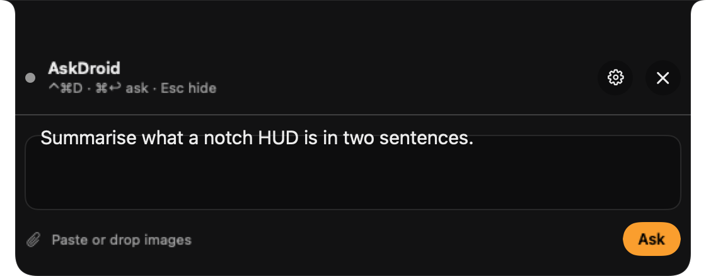
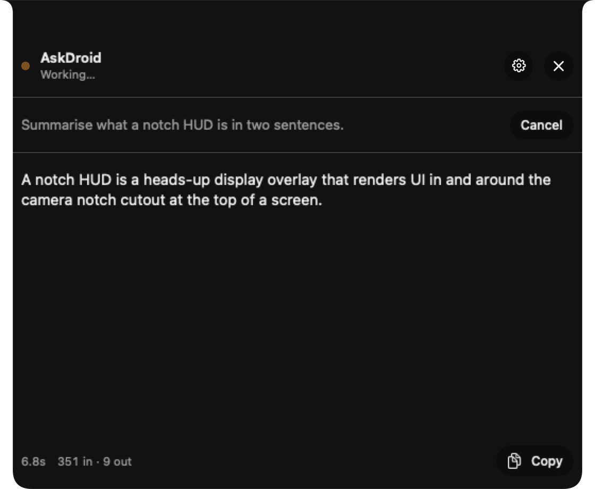
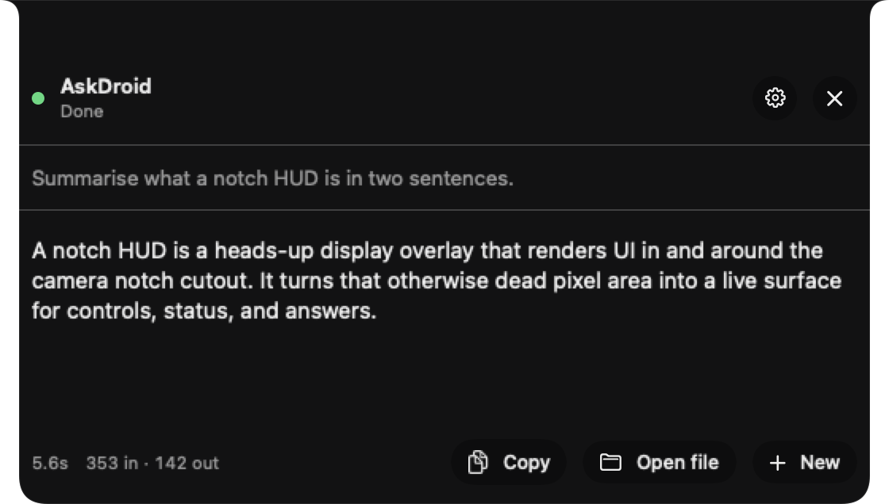
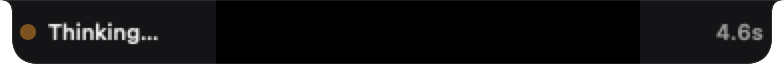
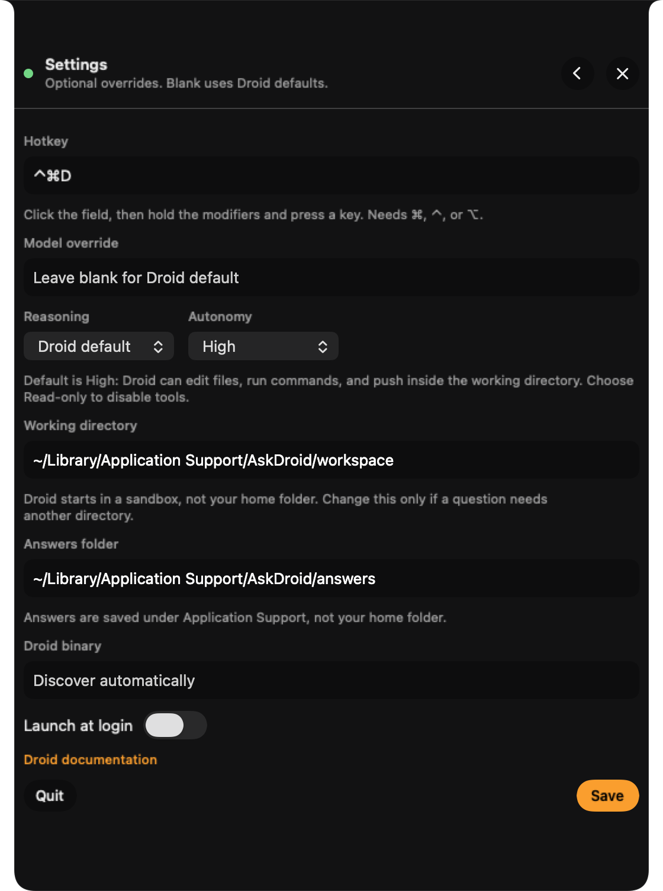

# AskDroid

Press a hotkey on your Mac. A HUD grows out of the camera housing. Ask Droid, paste images, watch the answer stream, keep a Markdown file.

On a notched MacBook the surface uses the real notch size and a Dynamic Island silhouette. External displays and older Macs get a floating capsule instead.



```
⌃⌘D  →  type or paste  →  ⌘Return  →  ~/Library/Application Support/AskDroid/answers/
```

AskDroid is a native Swift/SwiftUI agent app. It does not replace Droid. It talks to the `droid` CLI you already have, using your default `~/.factory/settings.json`.

## What you need

- macOS 14 or later
- [Droid CLI](https://docs.factory.ai/droid-exec/overview) so `droid` works in Terminal
- Xcode / Swift 6 to build from source

## Install

**From a release (recommended):** download the latest `AskDroid-<version>-macOS.zip` from the Releases page, unzip, and move `AskDroid.app` to `/Applications`.

**From source:** see [Build](#build) below.

The app is an accessory process: no Dock icon, no menu bar item. The hotkey is the front door — after launching, press **⌃⌘D** and the HUD appears.

To start it at login, open the HUD, click the gear, enable **Launch at login**.

### Local Network permission

AskDroid talks to the `droid` CLI, which may in turn reach a model server on your local network (for example, a local MLX server). The first time that happens, macOS asks for **Local Network** permission:

1. Launch AskDroid and ask a question.
2. If macOS prompts *"AskDroid would like to find and connect to devices on your local network"*, click **Allow**.

If the HUD is open when the prompt appears, it can hide behind the panel and the run fails with a *Connection error* and no answer. Fix it in **System Settings → Privacy & Security → Local Network → enable AskDroid**, quit and relaunch AskDroid, then ask again. AskDroid's failure message points here automatically.


## Build

```bash
git clone <this-repo> AskDroid
cd AskDroid
./scripts/build-app.sh
open dist/AskDroid.app
```

## Use it

1. Press **⌃⌘D** from any app.
2. Type a question. Paste or drop images. **⌘Return** asks, **Esc** hides.
3. While Droid works, the HUD streams the answer. Hide it and a compact pill stays beside the notch. Click the pill or press the hotkey to open it again.
4. Copy the answer (**⌘C** copies the whole answer when it's ready), or open the archived Markdown file.

The HUD sets `NSWindow.sharingType = .none` and hides the compact pill during system screenshots (⌘⇧3 / 4 / 5) and Screenshot.app. A hotkey present still shows the panel. ScreenCaptureKit recorders on macOS 15+ can still see it.

On login-item launch the HUD stays hidden until you press the hotkey. Opening the app from Finder or Spotlight still presents the composer.

The hotkey is configurable in Settings: click the field and press a shortcut (must include ⌘, ⌃, or ⌥). If another app already owns that Carbon hotkey, AskDroid says so.

The answer streams token by token, with elapsed time and token counts. Session activity is behind a disclosure:



When the turn finishes you get the whole answer, a copy button, and a link to the saved file:



Press **Esc** mid-run and the HUD collapses to a pill that keeps the status under the notch:



Files land in **Application Support/AskDroid/answers**:

```
droid-2026-08-15_20-32-00.md
droid-2026-08-15_20-32-00-1.png
```

If two questions finish in the same second, the next file gets a `-2` suffix.

## Settings



All optional. Blank means “use Droid’s own defaults.”

- Model override
- Reasoning effort
- Autonomy (`off` / `low` / `medium` / `high`)
- Working directory (default `~/Library/Application Support/AskDroid/workspace`)
- Answers folder (default `~/Library/Application Support/AskDroid/answers`)
- Path to the `droid` binary
- Launch at login

AskDroid looks for `droid` on `PATH`, then in `~/.local/bin`, mise shims, and Homebrew.

Default autonomy is **high**: Droid can edit files, run commands, and push, scoped to the working directory (which defaults to a sandboxed workspace under Application Support). Choose Read-only in Settings to disable tools. Any permission prompt that still appears is auto-declined.

## Tests

```bash
swift test
```

To refresh the README captures after a HUD change:

```bash
./scripts/render-screenshots.sh
```

That runs the `AskDroidScreenshots` tool (not the accessory) and writes transparent PNGs into `docs/screenshots/`.

## Why not Shortcuts?

Shortcuts cannot paste images into the agent, cannot stream progress, and start with a tiny `PATH`. AskDroid is a real process that speaks Droid’s JSON-RPC protocol:

```
droid exec --input-format stream-jsonrpc --output-format stream-jsonrpc
```
